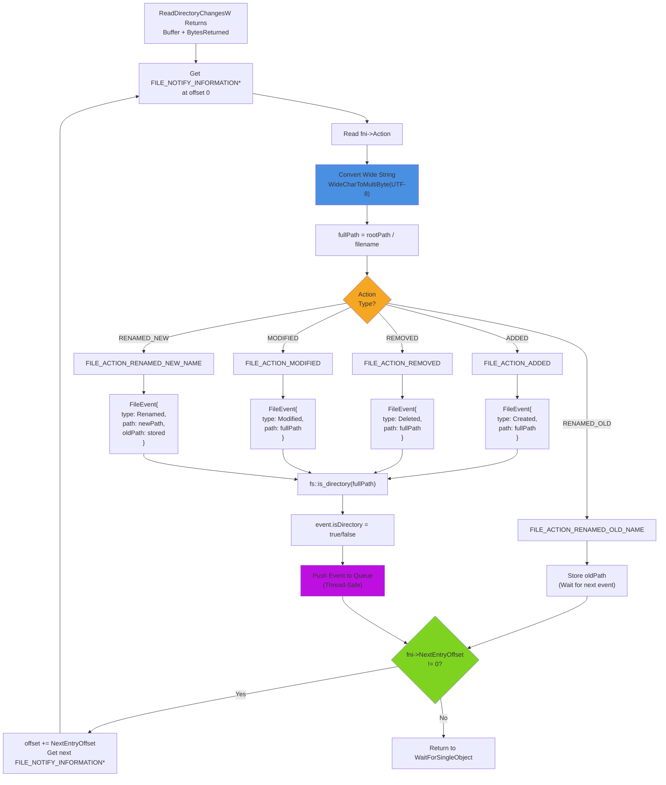

```mermaid
graph TD
    Start["ReadDirectoryChangesW Returns<br/>Buffer + BytesReturned"]
    
    GetPtr["Get FILE_NOTIFY_INFORMATION*<br/>at offset 0"]
    
    ReadAction["Read fni->Action"]
    CheckAction{"Action<br/>Type?"}
    
    ActionAdded["FILE_ACTION_ADDED"]
    ActionRemoved["FILE_ACTION_REMOVED"]
    ActionModified["FILE_ACTION_MODIFIED"]
    ActionRenamedOld["FILE_ACTION_RENAMED_OLD_NAME"]
    ActionRenamedNew["FILE_ACTION_RENAMED_NEW_NAME"]
    
    CreateCreated["FileEvent{<br/>type: Created,<br/>path: fullPath<br/>}"]
    CreateDeleted["FileEvent{<br/>type: Deleted,<br/>path: fullPath<br/>}"]
    CreateModified["FileEvent{<br/>type: Modified,<br/>path: fullPath<br/>}"]
    StoreOldPath["Store oldPath<br/>(Wait for next event)"]
    CreateRenamed["FileEvent{<br/>type: Renamed,<br/>path: newPath,<br/>oldPath: stored<br/>}"]
    
    ConvertPath["Convert Wide String<br/>WideCharToMultiByte(UTF-8)"]
    BuildFullPath["fullPath = rootPath / filename"]
    CheckIsDir["fs::is_directory(fullPath)"]
    SetIsDir["event.isDirectory = true/false"]
    
    PushToQueue["Push Event to Queue<br/>(Thread-Safe)"]
    
    CheckNext{"fni->NextEntryOffset<br/>!= 0?"}
    IncrementOffset["offset += NextEntryOffset<br/>Get next FILE_NOTIFY_INFORMATION*"]
    Done["Return to WaitForSingleObject"]
    
    Start --> GetPtr
    GetPtr --> ReadAction
    ReadAction --> ConvertPath
    ConvertPath --> BuildFullPath
    BuildFullPath --> CheckAction
    
    CheckAction -->|"ADDED"| ActionAdded
    CheckAction -->|"REMOVED"| ActionRemoved
    CheckAction -->|"MODIFIED"| ActionModified
    CheckAction -->|"RENAMED_OLD"| ActionRenamedOld
    CheckAction -->|"RENAMED_NEW"| ActionRenamedNew
    
    ActionAdded --> CreateCreated
    ActionRemoved --> CreateDeleted
    ActionModified --> CreateModified
    ActionRenamedOld --> StoreOldPath
    ActionRenamedNew --> CreateRenamed
    
    CreateCreated --> CheckIsDir
    CreateDeleted --> CheckIsDir
    CreateModified --> CheckIsDir
    CreateRenamed --> CheckIsDir
    StoreOldPath --> CheckNext
    
    CheckIsDir --> SetIsDir
    SetIsDir --> PushToQueue
    PushToQueue --> CheckNext
    
    CheckNext -->|"Yes"| IncrementOffset
    CheckNext -->|"No"| Done
    IncrementOffset --> GetPtr
    
    style ConvertPath fill:#4a90e2
    style CheckAction fill:#f5a623
    style PushToQueue fill:#bd10e0
    style CheckNext fill:#7ed321
```