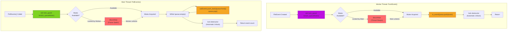

```mermaid
graph TD
    subgraph "Worker Thread: PushEvent()"
        WT_Start["FileEvent Created"]
        WT_Lock["std::lock_guard<std::mutex> lock(m_queueMutex)"]
        WT_Check{"Mutex<br/>Available?"}
        WT_Block["Block/Wait<br/>(Thread Sleeps)"]
        WT_Acquired["Mutex Acquired"]
        WT_Push["m_eventQueue.push(event)"]
        WT_Unlock["lock destructor<br/>(Automatic Unlock)"]
        WT_End["Return"]
    end
    
    subgraph "Main Thread: PollEvents()"
        MT_Start["PollEvents() Called"]
        MT_Lock["std::lock_guard<std::mutex> lock(m_queueMutex)"]
        MT_Check{"Mutex<br/>Available?"}
        MT_Block["Block/Wait<br/>(Frame Stalls!)"]
        MT_Acquired["Mutex Acquired"]
        MT_Loop["While !queue.empty()"]
        MT_Pop["outEvents.push_back(queue.front())<br/>queue.pop()"]
        MT_Unlock["lock destructor<br/>(Automatic Unlock)"]
        MT_Return["Return event count"]
    end
    
    WT_Start --> WT_Lock
    WT_Lock --> WT_Check
    WT_Check -->|"Locked by Main"| WT_Block
    WT_Check -->|"Available"| WT_Acquired
    WT_Block -.->|"Main unlocks"| WT_Acquired
    WT_Acquired --> WT_Push
    WT_Push --> WT_Unlock
    WT_Unlock --> WT_End
    
    MT_Start --> MT_Lock
    MT_Lock --> MT_Check
    MT_Check -->|"Locked by Worker"| MT_Block
    MT_Check -->|"Available"| MT_Acquired
    MT_Block -.->|"Worker unlocks"| MT_Acquired
    MT_Acquired --> MT_Loop
    MT_Loop --> MT_Pop
    MT_Pop --> MT_Loop
    MT_Loop --> MT_Unlock
    MT_Unlock --> MT_Return
    
    style WT_Lock fill:#bd10e0
    style WT_Block fill:#ff6b6b
    style MT_Lock fill:#7ed321
    style MT_Block fill:#ff6b6b
    style WT_Push fill:#f5a623
    style MT_Pop fill:#f5a623
```