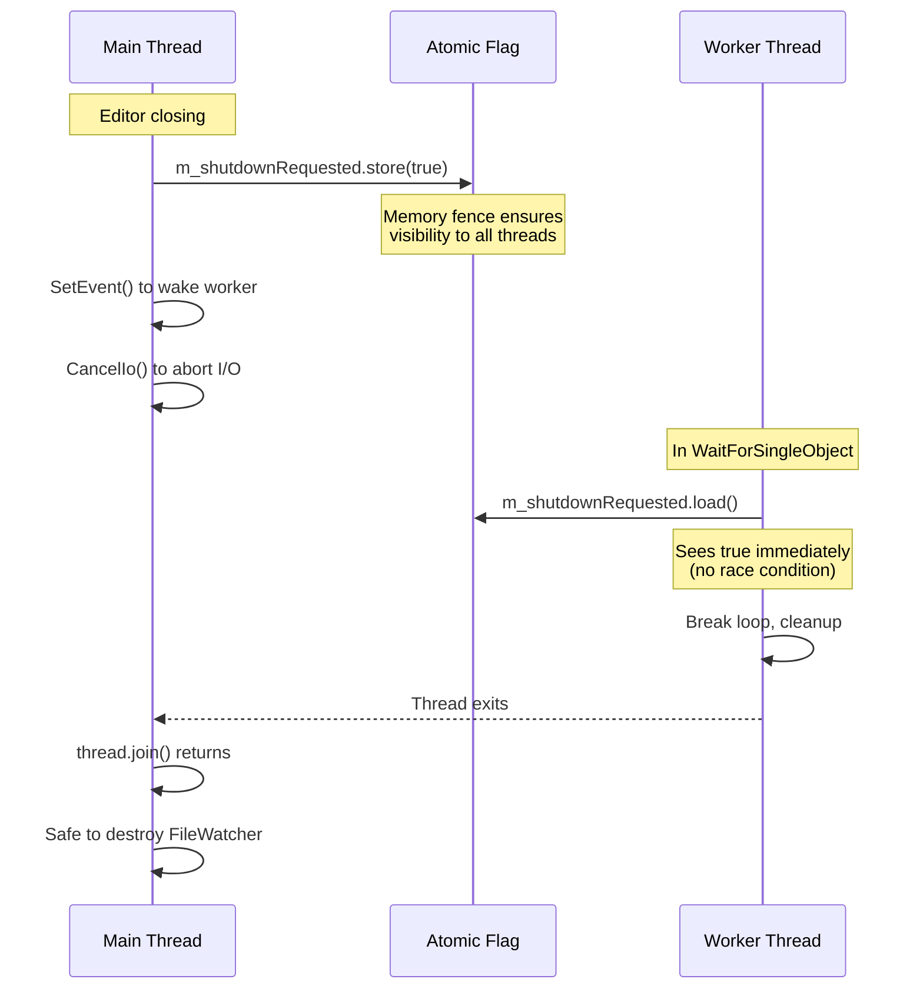

```mermaid
sequenceDiagram
    participant Main as Main Thread
    participant Flag as Atomic Flag
    participant Worker as Worker Thread
    
    Note over Main: Editor closing
    
    Main->>Flag: m_shutdownRequested.store(true)
    Note over Flag: Memory fence ensures<br/>visibility to all threads
    
    Main->>Main: SetEvent() to wake worker
    Main->>Main: CancelIo() to abort I/O
    
    Note over Worker: In WaitForSingleObject
    Worker->>Flag: m_shutdownRequested.load()
    Note over Worker: Sees true immediately<br/>(no race condition)
    
    Worker->>Worker: Break loop, cleanup
    Worker-->>Main: Thread exits
    
    Main->>Main: thread.join() returns
    Main->>Main: Safe to destroy FileWatcher
```