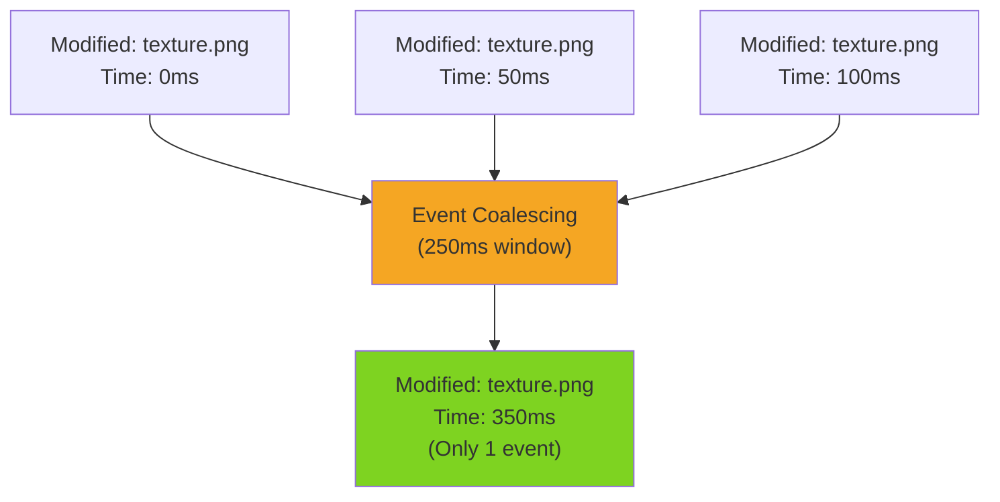

```mermaid
graph TD
    RawEvent1["Modified: texture.png<br/>Time: 0ms"]
    RawEvent2["Modified: texture.png<br/>Time: 50ms"]
    RawEvent3["Modified: texture.png<br/>Time: 100ms"]
    
    Coalesce["Event Coalescing<br/>(250ms window)"]
    
    SingleEvent["Modified: texture.png<br/>Time: 350ms<br/>(Only 1 event)"]
    
    RawEvent1 --> Coalesce
    RawEvent2 --> Coalesce
    RawEvent3 --> Coalesce
    Coalesce --> SingleEvent
    
    style Coalesce fill:#f5a623
    style SingleEvent fill:#7ed321
```