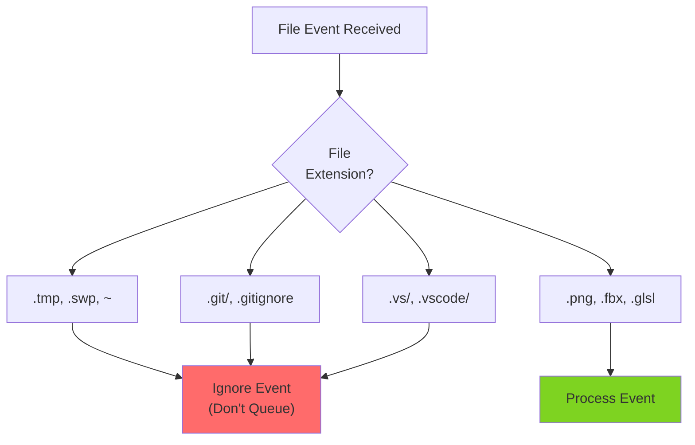

```mermaid
graph TD
    Event["File Event Received"]
    
    CheckExt{"File<br/>Extension?"}
    
    Temp[".tmp, .swp, ~"]
    Git[".git/, .gitignore"]
    System[".vs/, .vscode/"]
    Valid[".png, .fbx, .glsl"]
    
    Ignore["Ignore Event<br/>(Don't Queue)"]
    Process["Process Event"]
    
    Event --> CheckExt
    CheckExt --> Temp
    CheckExt --> Git
    CheckExt --> System
    CheckExt --> Valid
    
    Temp --> Ignore
    Git --> Ignore
    System --> Ignore
    Valid --> Process
    
    style Ignore fill:#ff6b6b
    style Process fill:#7ed321
```