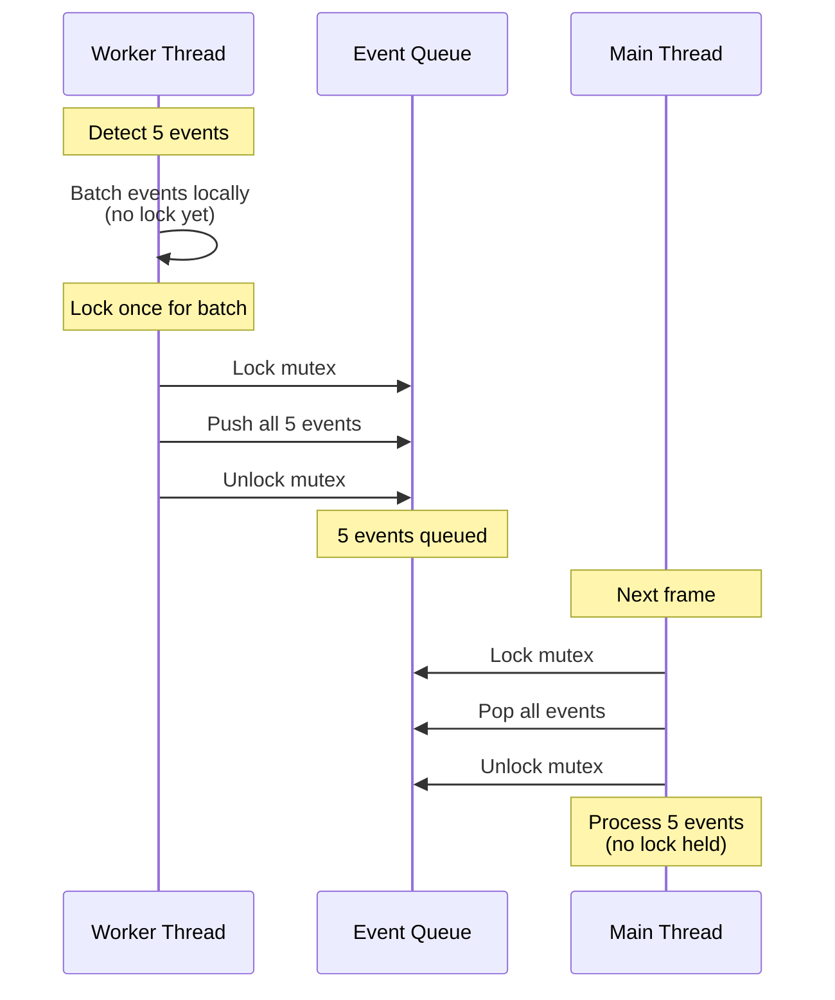

```mermaid
sequenceDiagram
    participant WT as Worker Thread
    participant Q as Event Queue
    participant MT as Main Thread
    
    Note over WT: Detect 5 events
    WT->>WT: Batch events locally<br/>(no lock yet)
    
    Note over WT: Lock once for batch
    WT->>Q: Lock mutex
    WT->>Q: Push all 5 events
    WT->>Q: Unlock mutex
    
    Note over Q: 5 events queued
    
    Note over MT: Next frame
    MT->>Q: Lock mutex
    MT->>Q: Pop all events
    MT->>Q: Unlock mutex
    
    Note over MT: Process 5 events<br/>(no lock held)
```