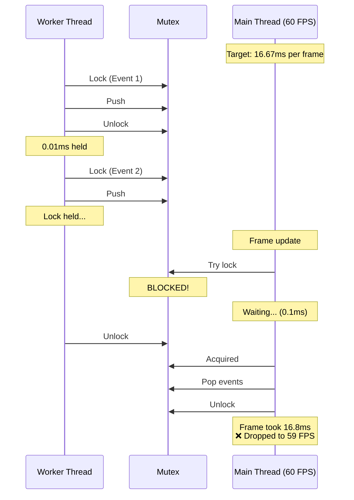

```mermaid
sequenceDiagram
    participant WT as Worker Thread
    participant Lock as Mutex
    participant MT as Main Thread (60 FPS)
    
    Note over MT: Target: 16.67ms per frame
    
    WT->>Lock: Lock (Event 1)
    WT->>Lock: Push
    WT->>Lock: Unlock
    Note over WT: 0.01ms held
    
    WT->>Lock: Lock (Event 2)
    WT->>Lock: Push
    Note over WT: Lock held...
    
    Note over MT: Frame update
    MT->>Lock: Try lock
    Note over Lock: BLOCKED!
    Note over MT: Waiting... (0.1ms)
    
    WT->>Lock: Unlock
    MT->>Lock: Acquired
    MT->>Lock: Pop events
    MT->>Lock: Unlock
    
    Note over MT: Frame took 16.8ms<br/>❌ Dropped to 59 FPS
```