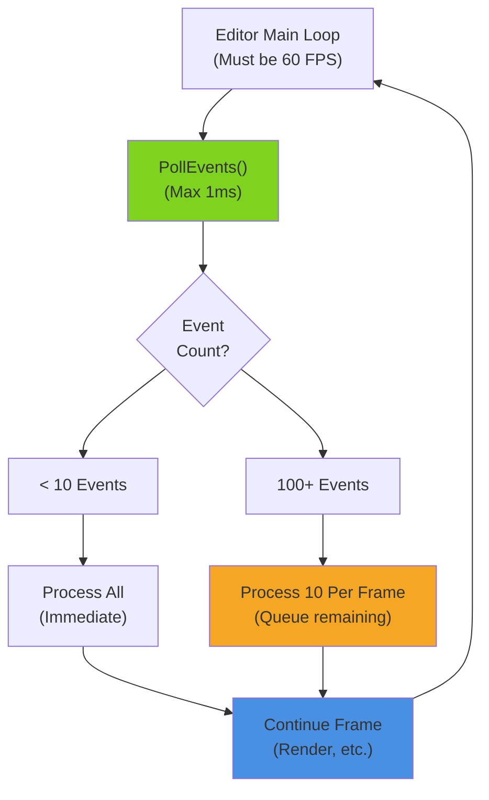

```mermaid
graph TD
    MainLoop["Editor Main Loop<br/>(Must be 60 FPS)"]
    
    PollEvents["PollEvents()<br/>(Max 1ms)"]
    
    CheckCount{"Event<br/>Count?"}
    
    Few["< 10 Events"]
    Many["100+ Events"]
    
    ProcessAll["Process All<br/>(Immediate)"]
    ProcessBatch["Process 10 Per Frame<br/>(Queue remaining)"]
    
    Continue["Continue Frame<br/>(Render, etc.)"]
    
    MainLoop --> PollEvents
    PollEvents --> CheckCount
    
    CheckCount --> Few
    CheckCount --> Many
    
    Few --> ProcessAll
    Many --> ProcessBatch
    
    ProcessAll --> Continue
    ProcessBatch --> Continue
    Continue --> MainLoop
    
    style PollEvents fill:#7ed321
    style ProcessBatch fill:#f5a623
    style Continue fill:#4a90e2
```