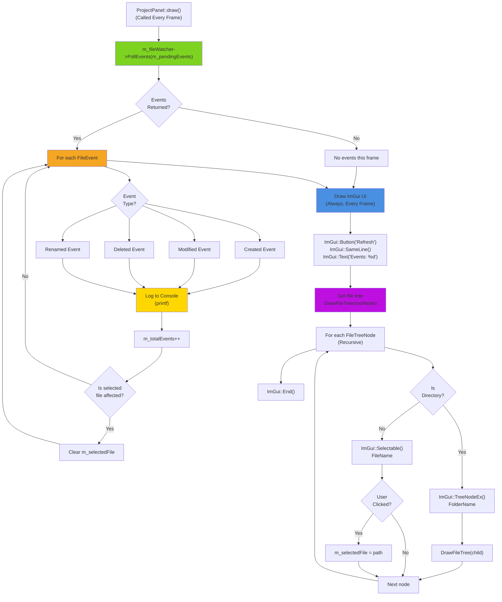

```mermaid
graph TD
    Start["ProjectPanel::draw()<br/>(Called Every Frame)"]
    PollFW["m_fileWatcher->PollEvents(m_pendingEvents)"]
    CheckEvents{"Events<br/>Returned?"}
    
    NoEvents["No events this frame"]
    ProcessLoop["For each FileEvent"]
    
    CheckType{"Event<br/>Type?"}
    Created["Created Event"]
    Modified["Modified Event"]
    Deleted["Deleted Event"]
    Renamed["Renamed Event"]
    
    LogEvent["Log to Console<br/>(printf)"]
    UpdateStats["m_totalEvents++"]
    CheckSelection{"Is selected<br/>file affected?"}
    ClearSelection["Clear m_selectedFile"]
    
    DrawUI["Draw ImGui UI<br/>(Always, Every Frame)"]
    DrawToolbar["ImGui::Button('Refresh')<br/>ImGui::SameLine()<br/>ImGui::Text('Events: %d')"]
    DrawTree["Get file tree<br/>DrawFileTree(rootNode)"]
    
    TreeLoop["For each FileTreeNode<br/>(Recursive)"]
    CheckDir{"Is<br/>Directory?"}
    
    DrawFolder["ImGui::TreeNodeEx()<br/> FolderName"]
    Recurse["DrawFileTree(child)"]
    DrawFile["ImGui::Selectable()<br/> FileName"]
    
    CheckClick{"User<br/>Clicked?"}
    SelectFile["m_selectedFile = path"]
    
    Continue["Next node"]
    End["ImGui::End()"]
    
    Start --> PollFW
    PollFW --> CheckEvents
    
    CheckEvents -->|"No"| NoEvents
    CheckEvents -->|"Yes"| ProcessLoop
    
    NoEvents --> DrawUI
    
    ProcessLoop --> CheckType
    CheckType --> Created
    CheckType --> Modified
    CheckType --> Deleted
    CheckType --> Renamed
    
    Created --> LogEvent
    Modified --> LogEvent
    Deleted --> LogEvent
    Renamed --> LogEvent
    
    LogEvent --> UpdateStats
    UpdateStats --> CheckSelection
    CheckSelection -->|"Yes"| ClearSelection
    CheckSelection -->|"No"| ProcessLoop
    ClearSelection --> ProcessLoop
    ProcessLoop --> DrawUI
    
    DrawUI --> DrawToolbar
    DrawToolbar --> DrawTree
    
    DrawTree --> TreeLoop
    TreeLoop --> CheckDir
    
    CheckDir -->|"Yes"| DrawFolder
    CheckDir -->|"No"| DrawFile
    
    DrawFolder --> Recurse
    Recurse --> Continue
    DrawFile --> CheckClick
    
    CheckClick -->|"Yes"| SelectFile
    CheckClick -->|"No"| Continue
    
    SelectFile --> Continue
    Continue --> TreeLoop
    TreeLoop --> End
    
    style PollFW fill:#7ed321
    style ProcessLoop fill:#f5a623
    style DrawUI fill:#4a90e2
    style DrawTree fill:#bd10e0
    style LogEvent fill:#ffd700

```