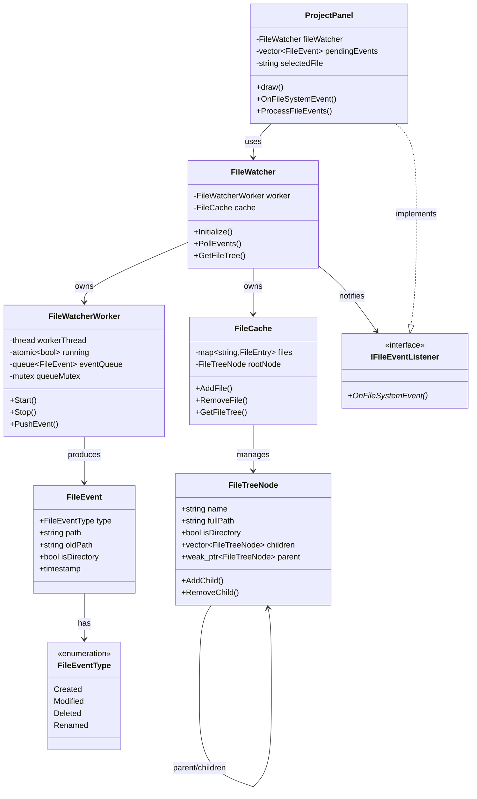

```mermaid
classDiagram
    %% Core Data Structures
    class FileEventType {
        <<enumeration>>
        Created
        Modified
        Deleted
        Renamed
    }
    
    class FileEvent {
        +FileEventType type
        +string path
        +string oldPath
        +bool isDirectory
        +timestamp
    }
    
    class FileTreeNode {
        +string name
        +string fullPath
        +bool isDirectory
        +vector~FileTreeNode~ children
        +weak_ptr~FileTreeNode~ parent
        +AddChild()
        +RemoveChild()
    }
    
    class FileCache {
        -map~string,FileEntry~ files
        -FileTreeNode rootNode
        +AddFile()
        +RemoveFile()
        +GetFileTree()
    }
    
    class FileWatcherWorker {
        -thread workerThread
        -atomic~bool~ running
        -queue~FileEvent~ eventQueue
        -mutex queueMutex
        +Start()
        +Stop()
        +PushEvent()
    }
    
    class FileWatcher {
        -FileWatcherWorker worker
        -FileCache cache
        +Initialize()
        +PollEvents()
        +GetFileTree()
    }
    
    class IFileEventListener {
        <<interface>>
        +OnFileSystemEvent()*
    }
    
    class ProjectPanel {
        -FileWatcher fileWatcher
        -vector~FileEvent~ pendingEvents
        -string selectedFile
        +draw()
        +OnFileSystemEvent()
        +ProcessFileEvents()
    }
    
    %% Relationships
    FileEvent --> FileEventType : has
    FileTreeNode --> FileTreeNode : parent/children
    FileCache --> FileTreeNode : manages
    FileWatcherWorker --> FileEvent : produces
    FileWatcher --> FileWatcherWorker : owns
    FileWatcher --> FileCache : owns
    ProjectPanel --> FileWatcher : uses
    ProjectPanel ..|> IFileEventListener : implements
    FileWatcher --> IFileEventListener : notifies
```