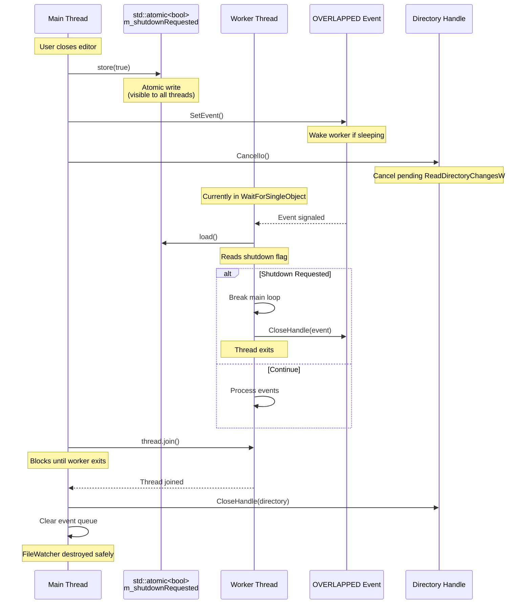

```mermaid
sequenceDiagram
    participant Main as Main Thread
    participant Flag as std::atomic<bool><br/>m_shutdownRequested
    participant Worker as Worker Thread
    participant Event as OVERLAPPED Event
    participant Handle as Directory Handle
    
    Note over Main: User closes editor
    Main->>Flag: store(true)
    Note over Flag: Atomic write<br/>(visible to all threads)
    
    Main->>Event: SetEvent()
    Note over Event: Wake worker if sleeping
    
    Main->>Handle: CancelIo()
    Note over Handle: Cancel pending ReadDirectoryChangesW
    
    Note over Worker: Currently in WaitForSingleObject
    Event-->>Worker: Event signaled
    
    Worker->>Flag: load()
    Note over Worker: Reads shutdown flag
    
    alt Shutdown Requested
        Worker->>Worker: Break main loop
        Worker->>Event: CloseHandle(event)
        Note over Worker: Thread exits
    else Continue
        Worker->>Worker: Process events
    end
    
    Main->>Worker: thread.join()
    Note over Main: Blocks until worker exits
    
    Worker-->>Main: Thread joined
    
    Main->>Handle: CloseHandle(directory)
    Main->>Main: Clear event queue
    
    Note over Main: FileWatcher destroyed safely
```