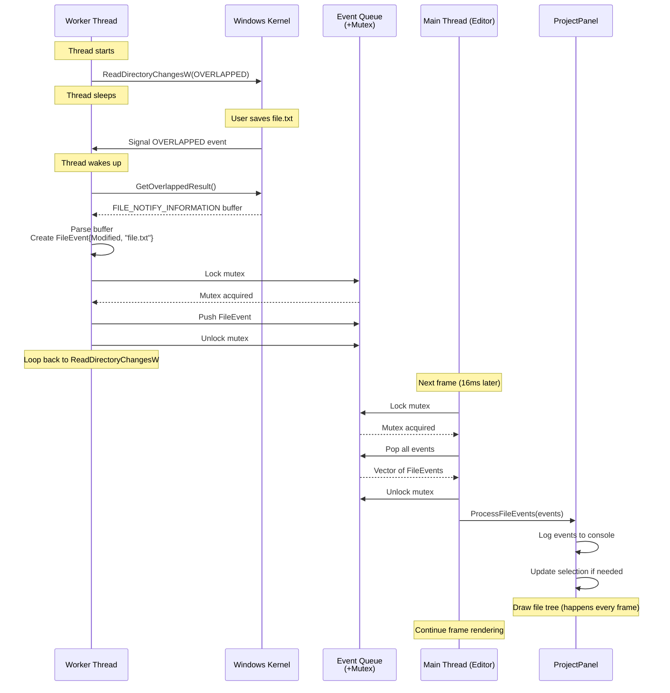

```mermaid
sequenceDiagram 
    participant WT as Worker Thread 
    participant OS as Windows Kernel 
    participant Q as Event Queue<br/>(+Mutex)
    participant MT as Main Thread (Editor) 
    participant UI as ProjectPanel
    
    Note over WT: Thread starts
    WT->>OS: ReadDirectoryChangesW(OVERLAPPED)
    Note over WT: Thread sleeps
    
    Note over OS: User saves file.txt
    OS->>WT: Signal OVERLAPPED event
    Note over WT: Thread wakes up
    
    WT->>OS: GetOverlappedResult()
    OS-->>WT: FILE_NOTIFY_INFORMATION buffer
    
    WT->>WT: Parse buffer<br/>Create FileEvent{Modified, "file.txt"}
    
    WT->>Q: Lock mutex
    Q-->>WT: Mutex acquired
    WT->>Q: Push FileEvent
    WT->>Q: Unlock mutex
    
    Note over WT: Loop back to ReadDirectoryChangesW
    
    Note over MT: Next frame (16ms later)
    MT->>Q: Lock mutex
    Q-->>MT: Mutex acquired
    MT->>Q: Pop all events
    Q-->>MT: Vector of FileEvents
    MT->>Q: Unlock mutex
    
    MT->>UI: ProcessFileEvents(events)
    UI->>UI: Log events to console
    UI->>UI: Update selection if needed
    
    Note over UI: Draw file tree (happens every frame)
    
    Note over MT: Continue frame rendering
```