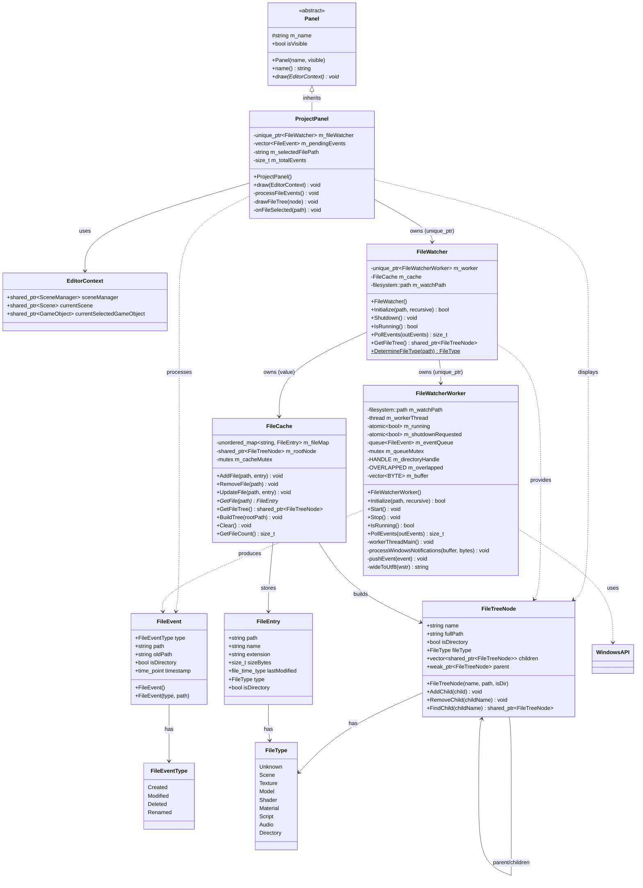

```mermaid
classDiagram 
    %% ============================================================ 
    %% LAYER 1: EDITOR UI (Main Thread) 
    %% ============================================================
    class Panel {
        <<abstract>>
        #string m_name
        +bool isVisible
        +Panel(name, visible)
        +name() string
        +draw(EditorContext)* void
    }
    
    class ProjectPanel {
        -unique_ptr~FileWatcher~ m_fileWatcher
        -vector~FileEvent~ m_pendingEvents
        -string m_selectedFilePath
        -size_t m_totalEvents
        +ProjectPanel()
        +draw(EditorContext) void
        -processFileEvents() void
        -drawFileTree(node) void
        -onFileSelected(path) void
    }
    
    class EditorContext {
        +shared_ptr~SceneManager~ sceneManager
        +shared_ptr~Scene~ currentScene
        +shared_ptr~GameObject~ currentSelectedGameObject
    }
    
    %% ============================================================
    %% LAYER 2: COORDINATOR (Main Thread)
    %% ============================================================
    
    class FileWatcher {
        -unique_ptr~FileWatcherWorker~ m_worker
        -FileCache m_cache
        -filesystem::path m_watchPath
        +FileWatcher()
        +Initialize(path, recursive) bool
        +Shutdown() void
        +IsRunning() bool
        +PollEvents(outEvents) size_t
        +GetFileTree() shared_ptr~FileTreeNode~
        +DetermineFileType(path)$ FileType
    }
    
    %% ============================================================
    %% LAYER 3: WORKER THREAD (Background)
    %% ============================================================
    
    class FileWatcherWorker {
        -filesystem::path m_watchPath
        -thread m_workerThread
        -atomic~bool~ m_running
        -atomic~bool~ m_shutdownRequested
        -queue~FileEvent~ m_eventQueue
        -mutex m_queueMutex
        -HANDLE m_directoryHandle
        -OVERLAPPED m_overlapped
        -vector~BYTE~ m_buffer
        +FileWatcherWorker()
        +Initialize(path, recursive) bool
        +Start() void
        +Stop() void
        +IsRunning() bool
        +PollEvents(outEvents) size_t
        -workerThreadMain() void
        -processWindowsNotifications(buffer, bytes) void
        -pushEvent(event) void
        -wideToUtf8(wstr) string
    }
    
    %% ============================================================
    %% DATA STRUCTURES
    %% ============================================================
    
    class FileCache {
        -unordered_map~string, FileEntry~ m_fileMap
        -shared_ptr~FileTreeNode~ m_rootNode
        -mutex m_cacheMutex
        +AddFile(path, entry) void
        +RemoveFile(path) void
        +UpdateFile(path, entry) void
        +GetFile(path) FileEntry*
        +GetFileTree() shared_ptr~FileTreeNode~
        +BuildTree(rootPath) void
        +Clear() void
        +GetFileCount() size_t
    }
    
    class FileTreeNode {
        +string name
        +string fullPath
        +bool isDirectory
        +FileType fileType
        +vector~shared_ptr~FileTreeNode~~ children
        +weak_ptr~FileTreeNode~ parent
        +FileTreeNode(name, path, isDir)
        +AddChild(child) void
        +RemoveChild(childName) void
        +FindChild(childName) shared_ptr~FileTreeNode~
    }
    
    class FileEntry {
        +string path
        +string name
        +string extension
        +size_t sizeBytes
        +file_time_type lastModified
        +FileType type
        +bool isDirectory
    }
    
    class FileEvent {
        +FileEventType type
        +string path
        +string oldPath
        +bool isDirectory
        +time_point timestamp
        +FileEvent()
        +FileEvent(type, path)
    }
    
    %% ============================================================
    %% ENUMS
    %% ============================================================
    
    class FileEventType {
        Created
        Modified
        Deleted
        Renamed
    }
    
    class FileType {
        Unknown
        Scene
        Texture
        Model
        Shader
        Material
        Script
        Audio
        Directory
    }
    
    %% ============================================================
    %% RELATIONSHIPS
    %% ============================================================
    
    Panel <|-- ProjectPanel : inherits
    ProjectPanel --> EditorContext : uses
    ProjectPanel --> FileWatcher : owns (unique_ptr)
    ProjectPanel ..> FileEvent : processes
    ProjectPanel ..> FileTreeNode : displays
    
    FileWatcher --> FileWatcherWorker : owns (unique_ptr)
    FileWatcher --> FileCache : owns (value)
    FileWatcher ..> FileTreeNode : provides
    
    FileWatcherWorker ..> FileEvent : produces
    FileWatcherWorker ..> `WindowsAPI` : uses
    
    FileCache --> FileEntry : stores
    FileCache --> FileTreeNode : builds
    
    FileTreeNode --> FileTreeNode : parent/children
    FileTreeNode --> FileType : has
    FileEvent --> FileEventType : has
    FileEntry --> FileType : has
```