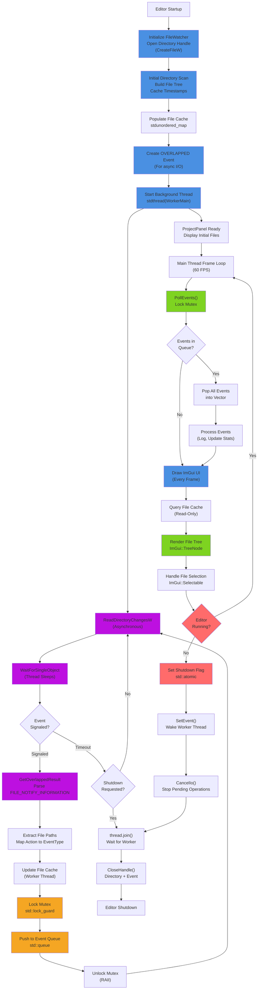

```mermaid
graph TD
    Start["Editor Startup"] 
    Init["Initialize FileWatcher<br/>Open Directory Handle<br/>(CreateFileW)"] 
    Scan["Initial Directory Scan<br/>Build File Tree<br/>Cache Timestamps"] 
    Cache["Populate File Cache<br/>stdunordered_map<path, time>"] 
    CreateEvent["Create OVERLAPPED Event<br/>(For async I/O)"] 
    StartMonitor["Start Background Thread<br/>stdthread(WorkerMain)"] 
    Ready["ProjectPanel Ready<br/>Display Initial Files"]
    WaitEvent["ReadDirectoryChangesW<br/>(Asynchronous)"]
    BlockThread["WaitForSingleObject<br/>(Thread Sleeps)"]
    CheckEvent{"Event<br/>Signaled?"}
    CheckShutdown{"Shutdown<br/>Requested?"}
    
    ProcessEvent["GetOverlappedResult<br/>Parse FILE_NOTIFY_INFORMATION"]
    ParseBuffer["Extract File Paths<br/>Map Action to EventType"]
    UpdateCache["Update File Cache<br/>(Worker Thread)"]
    LockQueue["Lock Mutex<br/>std::lock_guard"]
    PushQueue["Push to Event Queue<br/>std::queue<FileEvent>"]
    UnlockQueue["Unlock Mutex<br/>(RAII)"]
    
    MainFrame["Main Thread Frame Loop<br/>(60 FPS)"]
    PollEvents["PollEvents()<br/>Lock Mutex"]
    CheckQueue{"Events in<br/>Queue?"}
    PopEvents["Pop All Events<br/>into Vector"]
    ProcessEvents["Process Events<br/>(Log, Update Stats)"]
    
    DrawImGui["Draw ImGui UI<br/>(Every Frame)"]
    QueryCache["Query File Cache<br/>(Read-Only)"]
    RenderFiles["Render File Tree<br/>ImGui::TreeNode"]
    HandleSelect["Handle File Selection<br/>ImGui::Selectable"]
    
    CheckRunning{"Editor<br/>Running?"}
    RequestShutdown["Set Shutdown Flag<br/>std::atomic<bool>"]
    SignalEvent["SetEvent()<br/>Wake Worker Thread"]
    CancelIO["CancelIo()<br/>Stop Pending Operations"]
    JoinThread["thread.join()<br/>Wait for Worker"]
    CloseHandles["CloseHandle()<br/>Directory + Event"]
    End["Editor Shutdown"]
    
    Start --> Init
    Init --> Scan
    Scan --> Cache
    Cache --> CreateEvent
    CreateEvent --> StartMonitor
    StartMonitor --> Ready
    
    StartMonitor --> WaitEvent
    WaitEvent --> BlockThread
    BlockThread --> CheckEvent
    CheckEvent -->|"Timeout"| CheckShutdown
    CheckEvent -->|"Signaled"| ProcessEvent
    CheckShutdown -->|"No"| WaitEvent
    CheckShutdown -->|"Yes"| JoinThread
    
    ProcessEvent --> ParseBuffer
    ParseBuffer --> UpdateCache
    UpdateCache --> LockQueue
    LockQueue --> PushQueue
    PushQueue --> UnlockQueue
    UnlockQueue --> WaitEvent
    
    Ready --> MainFrame
    MainFrame --> PollEvents
    PollEvents --> CheckQueue
    CheckQueue -->|"Yes"| PopEvents
    CheckQueue -->|"No"| DrawImGui
    PopEvents --> ProcessEvents
    ProcessEvents --> DrawImGui
    
    DrawImGui --> QueryCache
    QueryCache --> RenderFiles
    RenderFiles --> HandleSelect
    HandleSelect --> CheckRunning
    
    CheckRunning -->|"Yes"| MainFrame
    CheckRunning -->|"No"| RequestShutdown
    RequestShutdown --> SignalEvent
    SignalEvent --> CancelIO
    CancelIO --> JoinThread
    JoinThread --> CloseHandles
    CloseHandles --> End
    
    style Init fill:#4a90e2
    style Scan fill:#4a90e2
    style CreateEvent fill:#4a90e2
    style StartMonitor fill:#4a90e2
    style WaitEvent fill:#bd10e0
    style BlockThread fill:#bd10e0
    style ProcessEvent fill:#bd10e0
    style LockQueue fill:#f5a623
    style PushQueue fill:#f5a623
    style PollEvents fill:#7ed321
    style DrawImGui fill:#4a90e2
    style RenderFiles fill:#7ed321
    style CheckRunning fill:#ff6b6b
    style RequestShutdown fill:#ff6b6b

```