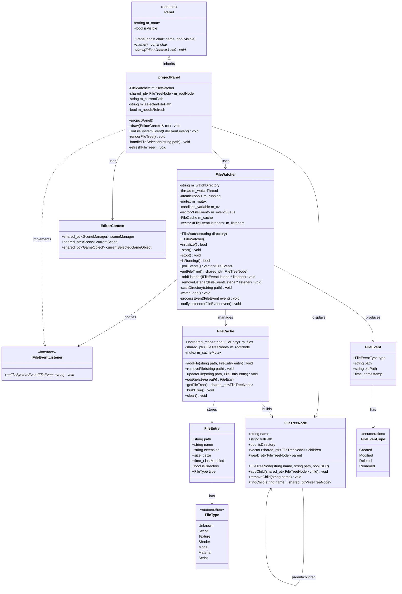

```mermaid
classDiagram
    class Panel {
        <<abstract>>
        #string m_name
        +bool isVisible
        +Panel(const char* name, bool visible)
        +name() const char*
        +draw(EditorContext& ctx)* void
    }
    
    class projectPanel {
        -FileWatcher* m_fileWatcher
        -shared_ptr~FileTreeNode~ m_rootNode
        -string m_currentPath
        -string m_selectedFilePath
        -bool m_needsRefresh
        +projectPanel()
        +draw(EditorContext& ctx) void
        +onFileSystemEvent(FileEvent event) void
        -renderFileTree() void
        -handleFileSelection(string path) void
        -refreshFileTree() void
    }
    
    class FileWatcher {
        -string m_watchDirectory
        -thread m_watchThread
        -atomic~bool~ m_running
        -mutex m_mutex
        -condition_variable m_cv
        -vector~FileEvent~ m_eventQueue
        -FileCache m_cache
        -vector~IFileEventListener*~ m_listeners
        +FileWatcher(string directory)
        +~FileWatcher()
        +initialize() bool
        +start() void
        +stop() void
        +isRunning() bool
        +pollEvents() vector~FileEvent~
        +getFileTree() shared_ptr~FileTreeNode~
        +addListener(IFileEventListener* listener) void
        +removeListener(IFileEventListener* listener) void
        -scanDirectory(string path) void
        -watchLoop() void
        -processEvent(FileEvent event) void
        -notifyListeners(FileEvent event) void
    }
    
    class IFileEventListener {
        <<interface>>
        +onFileSystemEvent(FileEvent event)* void
    }
    
    class FileCache {
        -unordered_map~string, FileEntry~ m_files
        -shared_ptr~FileTreeNode~ m_rootNode
        -mutex m_cacheMutex
        +addFile(string path, FileEntry entry) void
        +removeFile(string path) void
        +updateFile(string path, FileEntry entry) void
        +getFile(string path) FileEntry*
        +getFileTree() shared_ptr~FileTreeNode~
        +buildTree() void
        +clear() void
    }
    
    class FileTreeNode {
        +string name
        +string fullPath
        +bool isDirectory
        +vector~shared_ptr~FileTreeNode~~ children
        +weak_ptr~FileTreeNode~ parent
        +FileTreeNode(string name, string path, bool isDir)
        +addChild(shared_ptr~FileTreeNode~ child) void
        +removeChild(string name) void
        +findChild(string name) shared_ptr~FileTreeNode~
    }
    
    class FileEntry {
        +string path
        +string name
        +string extension
        +size_t size
        +time_t lastModified
        +bool isDirectory
        +FileType type
    }
    
    class FileEvent {
        +FileEventType type
        +string path
        +string oldPath
        +time_t timestamp
    }
    
    class FileEventType {
        <<enumeration>>
        Created
        Modified
        Deleted
        Renamed
    }
    
    class FileType {
        <<enumeration>>
        Unknown
        Scene
        Texture
        Shader
        Model
        Material
        Script
    }
    
    class EditorContext {
        +shared_ptr~SceneManager~ sceneManager
        +shared_ptr~Scene~ currentScene
        +shared_ptr~GameObject~ currentSelectedGameObject
    }
    
    Panel <|-- projectPanel : inherits
    IFileEventListener <|.. projectPanel : implements
    projectPanel --> FileWatcher : uses
    projectPanel --> EditorContext : uses
    projectPanel --> FileTreeNode : displays
    FileWatcher --> FileCache : manages
    FileWatcher --> FileEvent : produces
    FileWatcher --> IFileEventListener : notifies
    FileCache --> FileEntry : stores
    FileCache --> FileTreeNode : builds
    FileTreeNode --> FileTreeNode : parent/children
    FileEvent --> FileEventType : has
    FileEntry --> FileType : has
```