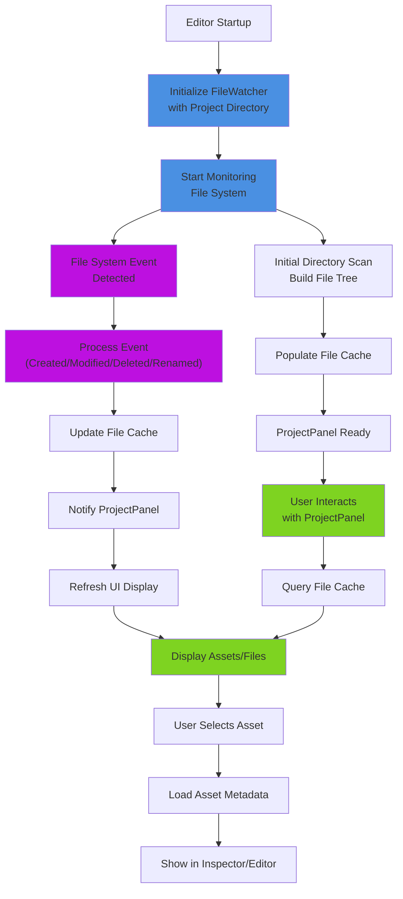

```mermaid
graph TD
    Start["Editor Startup"]
    Init["Initialize FileWatcher<br/>with Project Directory"]
    Monitor["Start Monitoring<br/>File System"]
    Scan["Initial Directory Scan<br/>Build File Tree"]
    Cache["Populate File Cache"]
    Ready["ProjectPanel Ready"]
    
    Event["File System Event<br/>Detected"]
    Process["Process Event<br/>(Created/Modified/Deleted/Renamed)"]
    Update["Update File Cache"]
    Notify["Notify ProjectPanel"]
    Refresh["Refresh UI Display"]
    
    UserAction["User Interacts<br/>with ProjectPanel"]
    Query["Query File Cache"]
    Display["Display Assets/Files"]
    Select["User Selects Asset"]
    LoadAsset["Load Asset Metadata"]
    ShowDetails["Show in Inspector/Editor"]
    
    Start --> Init
    Init --> Monitor
    Monitor --> Scan
    Scan --> Cache
    Cache --> Ready
    Ready --> UserAction
    
    Monitor --> Event
    Event --> Process
    Process --> Update
    Update --> Notify
    Notify --> Refresh
    Refresh --> Display
    
    UserAction --> Query
    Query --> Display
    Display --> Select
    Select --> LoadAsset
    LoadAsset --> ShowDetails
    
    style Init fill:#4a90e2
    style Monitor fill:#4a90e2
    style Event fill:#bd10e0
    style Process fill:#bd10e0
    style UserAction fill:#7ed321
    style Display fill:#7ed321
```