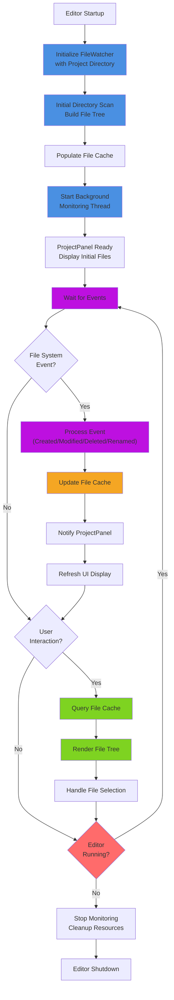

```mermaid
graph TD
    Start["Editor Startup"]
    Init["Initialize FileWatcher<br/>with Project Directory"]
    Scan["Initial Directory Scan<br/>Build File Tree"]
    Cache["Populate File Cache"]
    StartMonitor["Start Background<br/>Monitoring Thread"]
    Ready["ProjectPanel Ready<br/>Display Initial Files"]
    
    WaitEvent["Wait for Events"]
    CheckEvent{"File System<br/>Event?"}
    ProcessEvent["Process Event<br/>(Created/Modified/Deleted/Renamed)"]
    UpdateCache["Update File Cache"]
    NotifyUI["Notify ProjectPanel"]
    RefreshUI["Refresh UI Display"]
    
    CheckUser{"User<br/>Interaction?"}
    QueryCache["Query File Cache"]
    RenderFiles["Render File Tree"]
    HandleSelect["Handle File Selection"]
    
    CheckRunning{"Editor<br/>Running?"}
    Shutdown["Stop Monitoring<br/>Cleanup Resources"]
    End["Editor Shutdown"]
    
    Start --> Init
    Init --> Scan
    Scan --> Cache
    Cache --> StartMonitor
    StartMonitor --> Ready
    Ready --> WaitEvent
    
    WaitEvent --> CheckEvent
    CheckEvent -->|"Yes"| ProcessEvent
    CheckEvent -->|"No"| CheckUser
    
    ProcessEvent --> UpdateCache
    UpdateCache --> NotifyUI
    NotifyUI --> RefreshUI
    RefreshUI --> CheckUser
    
    CheckUser -->|"Yes"| QueryCache
    CheckUser -->|"No"| CheckRunning
    
    QueryCache --> RenderFiles
    RenderFiles --> HandleSelect
    HandleSelect --> CheckRunning
    
    CheckRunning -->|"Yes"| WaitEvent
    CheckRunning -->|"No"| Shutdown
    Shutdown --> End
    
    style Init fill:#4a90e2
    style Scan fill:#4a90e2
    style StartMonitor fill:#4a90e2
    style WaitEvent fill:#bd10e0
    style ProcessEvent fill:#bd10e0
    style UpdateCache fill:#f5a623
    style QueryCache fill:#7ed321
    style RenderFiles fill:#7ed321
    style CheckRunning fill:#ff6b6b
```